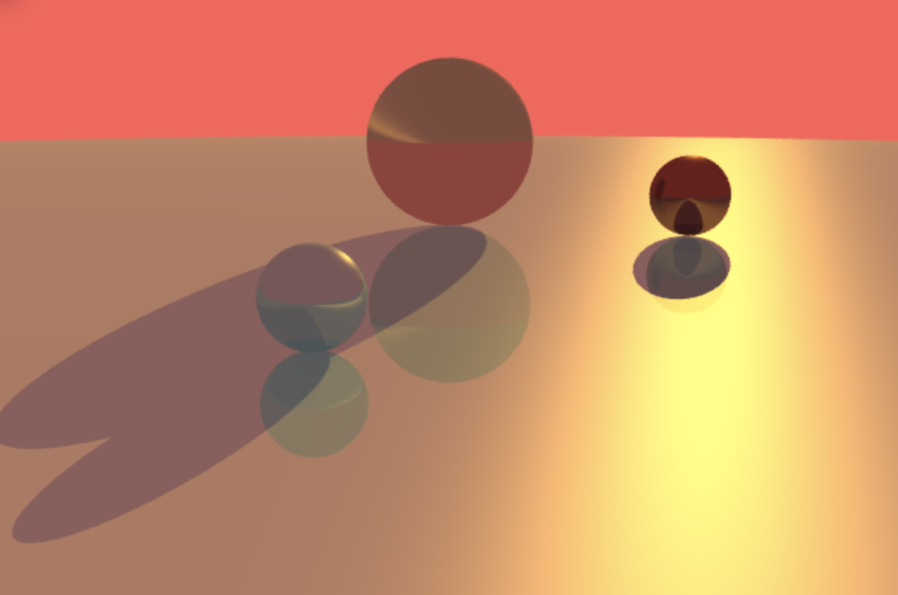

# ray-tracer

Here is an implementation of a ray tracer. The anti-aliasing is achieved by performing subpixel sampling. We increase the number of subpixel samples taken for each pixel. The final pixel color is calculated as the average between all of its subpixels. This method allows us to reduce the jagged edges and lighting effects. A check-box and a number input are implemented for this feature so that we can see the contrast before and after anti-aliasing and the effects of different random points.

Some 3d controls to the position of the camera are also implemented. Zooming in and out is associated with a scrolling action, which involves scaling the camera in the direction of the gaze. And rotating left or right is also implemented with a mouse moving left or right action. Rotation involves computing a rotation matrix for the camera position. The orthonormal basis of the camera is also taken into consideration. A future improvement of this rotation functionality is to compute the rotation matrix around the viewpoint, or the camera center, which would be more useful. A subsampling method is also implemented during the transition states so that we could reduce the processing time.

# result demo

